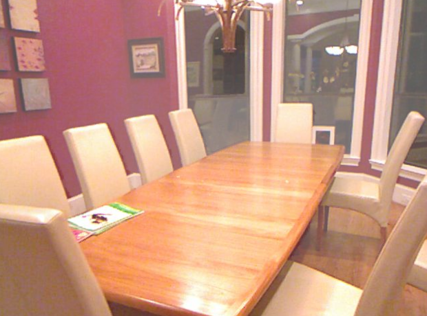
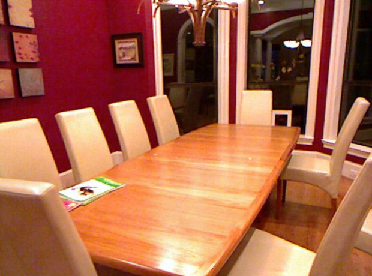
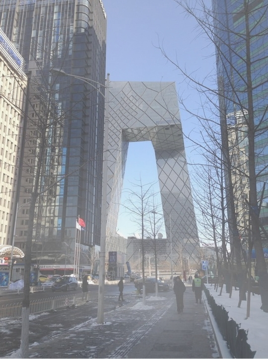
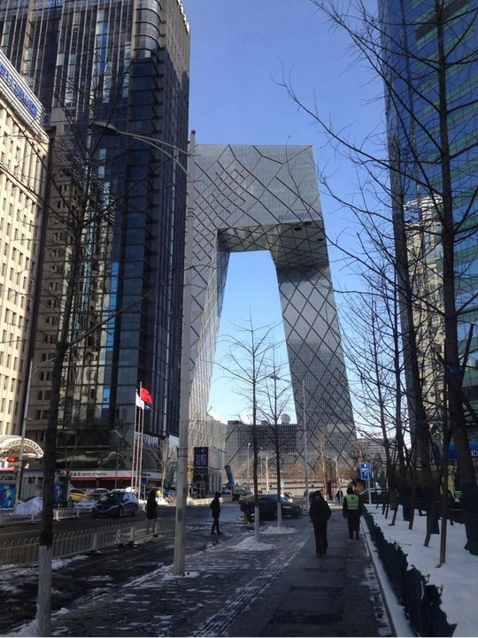

##  [FFA-Net: Feature Fusion Attention Network for Single Image Dehazing](https://arxiv.org/abs/1911.07559) (AAAI 2020)
 Official implementation.

---

by Xu Qin, Zhilin Wang et al.    Peking University and Beijing University of Aeronautics & Astronautics.

### Citation

@inproceedings{qin2020ffa,  
  title={FFA-Net: Feature fusion attention network for single image dehazing},  
  author={Qin, Xu and Wang, Zhilin and Bai, Yuanchao and Xie, Xiaodong and Jia, Huizhu},  
  booktitle={Proceedings of the AAAI Conference on Artificial Intelligence},  
  volume={34},  
  number={07},  
  pages={11908--11915},  
  year={2020}  
}

### Dependencies and Installation

* python3
* PyTorch>=1.0
* NVIDIA GPU+CUDA
* numpy
* matplotlib
* tensorboardX(optional)

### Datasets Preparation

The original project was built for `RESIDE`, but the local copy in this repository has already been adapted to your custom paired dehazing dataset.

Current supported local dataset structure:

```text
datasets/
  train/
    haze_images/
    original_images/
  valid/
    haze_images/
    original_images/
  test/
    haze_images/
    original_images/
```

Filename pairing supports the local pattern:

```text
cloudy_0007_1_2.jpg -> cloudy_0007.jpg
```

The last two suffixes are ignored for GT matching.


### Metrics update
|Methods|Indoor(PSNR/SSIM)|Outdoor(PSNR/SSIM)|
|-|-|-|
|DCP|16.62/0.8179|19.13/0.8148|
|AOD-Net|19.06/0.8504|20.29/0.8765|
|DehazeNet|21.14/0.8472|22.46/0.8514|
|GFN|22.30/0.8800|21.55/0.8444|
|GCANet|30.23/0.9800|-/-|
|Ours|36.39/0.9886|33.57/0.9840|
### Usage

#### Train on the local dehazing dataset

Train from scratch:

```bash
cd net

CUDA_VISIBLE_DEVICES=0 python main.py \
  --net ffa \
  --trainset dehaze_train \
  --testset dehaze_test \
  --dataroot /mnt/workspace/Dehaze/datasets \
  --train_split train \
  --test_split valid \
  --lq_dirname haze_images \
  --gt_dirname original_images \
  --crop \
  --crop_size 240 \
  --bs 8 \
  --steps 100000 \
  --eval_step 5000 \
  --gps 3 \
  --blocks 19 \
  --lr 1e-4 \
  --num_workers 0 \
  --output_dir /mnt/workspace/Dehaze/result/ffa_local_train
```

#### Finetune from a pretrained checkpoint

The local training entry now supports:

- `--pretrained_checkpoint`: load model weights only
- `--resume_checkpoint`: resume full training state
- `--output_dir`: directory used to save checkpoints

Example: transfer from the original ITS pretrained weights

```bash
cd net

CUDA_VISIBLE_DEVICES=0 python main.py \
  --net ffa \
  --trainset dehaze_train \
  --testset dehaze_test \
  --dataroot /mnt/workspace/Dehaze/datasets \
  --train_split train \
  --test_split valid \
  --lq_dirname haze_images \
  --gt_dirname original_images \
  --crop \
  --crop_size 240 \
  --bs 8 \
  --steps 100000 \
  --eval_step 5000 \
  --gps 3 \
  --blocks 19 \
  --lr 1e-4 \
  --num_workers 0 \
  --output_dir /mnt/workspace/Dehaze/result/ffa_transfer_from_its \
  --pretrained_checkpoint /mnt/workspace/Dehaze/algorithm/FFA-Net/its_train_ffa_3_19.pk
```

If you want to use the original OTS pretrained weights, replace the last argument with:

```bash
--pretrained_checkpoint /mnt/workspace/Dehaze/algorithm/FFA-Net/ots_train_ffa_3_19.pk
```

#### Resume local training

```bash
cd net

CUDA_VISIBLE_DEVICES=0 python main.py \
  --net ffa \
  --trainset dehaze_train \
  --testset dehaze_test \
  --dataroot /mnt/workspace/Dehaze/datasets \
  --train_split train \
  --test_split valid \
  --lq_dirname haze_images \
  --gt_dirname original_images \
  --crop \
  --crop_size 240 \
  --bs 8 \
  --steps 100000 \
  --eval_step 5000 \
  --gps 3 \
  --blocks 19 \
  --lr 1e-4 \
  --num_workers 0 \
  --output_dir /mnt/workspace/Dehaze/result/ffa_transfer_from_its \
  --resume_checkpoint /mnt/workspace/Dehaze/result/ffa_transfer_from_its/model-last.pt
```

Current local checkpoint format is:

- `model-<step>.pt`
- `model-last.pt`

#### Test on local images

The local `test.py` has also been adapted and now uses:

- `--checkpoint`
- `--input_dir`
- `--output_dir`

Example:

```bash
cd net

CUDA_VISIBLE_DEVICES=0 python test.py \
  --input_dir /mnt/workspace/Dehaze/datasets/test/haze_images \
  --output_dir /mnt/workspace/Dehaze/result/ffa_test \
  --checkpoint /mnt/workspace/Dehaze/result/ffa_transfer_from_its/model-last.pt \
  --gps 3 \
  --blocks 19 \
  --skip_zero_suffix
```

#### Notes

- If you hit multiprocessing cleanup errors under Python 3.12, prefer `--num_workers 0`.
- If some training images are smaller than `crop_size`, the local dataset loader will now resize them up first and then crop, instead of crashing.
- The original pretrained checkpoints still exist locally:
  - `its_train_ffa_3_19.pk`
  - `ots_train_ffa_3_19.pk`
#### Samples

<p align='center'>
 


</div>

<p align='center'>
 


</div>
